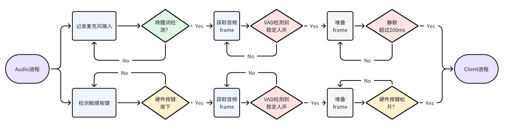
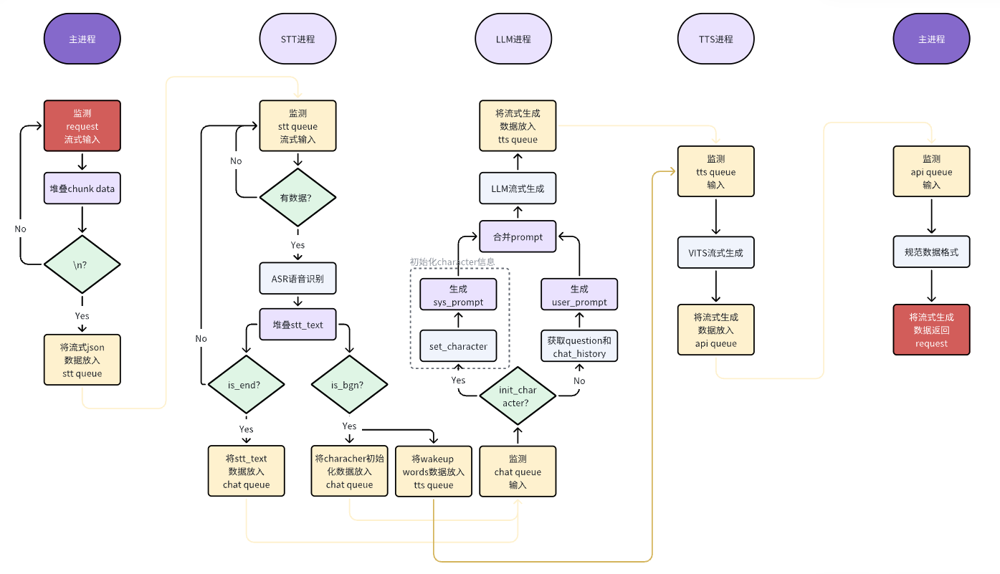

Takway.AI
=========

### 🎃面向角色扮演功能的多模态交互系统🤖 [[飞书Link](https://lleeei6t29.feishu.cn/docx/BzVWd57K9oyVSixhTamcv4tSnHf)]

- 🦾前端：基于Linux端侧平台的语音、视觉交互系统，可以实现语音唤醒、语音输入、语音播放、表情互动等功能。其中语音输入框架如图所示：



- 🖲️后端：基于Python Flask框架的后端语音识别服务，可以实现流式语音识别、大模型流式生成、流式语音合成等功能。后端多进程框架如下图所示：



---

### 📆项目更新日志

- **2024.3.14**：
  1. 接入[api-for-open-llm](https://github.com/xusenlinzy/api-for-open-llm)，支持本地部署模型，并统一模型服务API接口。
- **2024.3.13**：
  1. 接入[FunASR](https://github.com/alibaba-damo-academy/FunASR)，支持[modelscope](https://www.modelscope.cn/)上百种多语言语音识别模型。
- **2024.3.1**：
  1. 项目发布🔥🔥🔥🚀🚀🚀！
- **2024.2.27**：
  1. 调试并确认完成前后端通信数据格式；
  2. 初步确认大模型角色扮演系统运行。
- **2024.2.26**：
  1. 封装Character角色扮演代码封装 `RolyPlayingCharacterInfo`和 `RolyPlayingFunction`：
     ①支持自定义sys_prompt及调用；
     ②支持前端/后端character信息调用；
  2. 封装基于星火大模型的角色扮演对话系统；
  3. 封装基于本地Client的角色扮演系统；
  4. 重构前后端通信数据格式；
- **2024.2.25**：
  1. 完成板载前端系统和后端服务器对接；
     ①设置回答表情反应；
     ②设置角色扮演对话；
     ③问题：当语音流式播放时，动画播放卡顿，延迟高；
- **2024.2.22-2.24**：
  1. 完成后端服务器全流式多进程高并发并发系统 `TakwayApp`搭建；
     ①多线程支持流式获取并识别语音片段，等待完全识别后送入大模型生成部分；
     ②多线程支持流式大模型生成内容；
     ③多线程支持流式获取大模型输出，并输入到VITS端流式合成音频；
     ④流式返回音频数据，并实现本地快速播放；
- **2024.2.18**：
  1. 星火大模型代码封装 `SparkChatClient`：
     ①支持流式输出；
  2. VITS TTS代码封装 `TextToSpeech`：
     ①支持流式生成音频；
  3. 本地音频播放模块代码封装 `AudioPlayer`：
     ①支持VITS输出无损转换PCM；
     ②支持流式播放音频；
- **2024.2.17**：
  1. 本地语音系统代码封装 `PicovoiceRecorder`：
     ①增加VAD功能；
     ②增加 `Picovoice`的语音唤醒功能；
  2. 本地EMO表情管理模块代码封装 `EmoVideoPlayer`：
     ①增加随机wink功能；
     ②预留服务器端自定义表情接口；
  3. 完成本地Client客户端多进程系统搭建；


---

### 📌功能支持

- ✅ PicoVoice语音唤醒
- ✅ 后端全流式流式生成
- ✅ 支持FunASR框架和Modelscope模型库
- ✅ 支持本地模型API接入
- 🟥 支持闭源API模型统一接口接入
- 🟥 FastAPI高并发后端设计


## 🖥️安装和运行：


### 1. 创建conda环境并安装依赖：

- 安装基础依赖项(Linux): 
```
sudo apt-get update
sudo apt-get install cmake g++ gcc portaudio19-dev
```

- Conda环境安装(Win & Linux): 

```
   conda create -n takway python=3.8
   // 安装Pytorch，其他版本参照：https://pytorch.org/get-started/previous-versions
   pip3 install torch torchvision torchaudio --index-url https://download.pytorch.org/whl/cu118 
   pip install -r requirements.txt
```

### 2. 克隆项目到本地：

- `Takway`: 
```
   // 克隆项目到本地 https or ssh
   git clone https://github.com/Irvingao/takway_base.git or git clone git@github.com:Irvingao/takway_base.git
   cd takway_base
   pip install -v -e .
```

- `api-for-open-llm`: 
```
   git clone https://github.com/xusenlinzy/api-for-open-llm.git
   pip install -r api-for-open-llm/requirements.txt
```

### 3. 下载相关模型文件:
-  模型文件路径：
  ```
  - takway_base/
    - vits_model/
    - api-for-open-llm/
      - models/
        - internlm2-chat-1_8b
  ```

- InternLM模型：[internlm2-chat-1_8b](https://www.modelscope.cn/models/jayhust/internlm2-chat-1_8b/summary)
  ```
  // 下载InternLM模型(Linux: `apt-get install git-lfs`)
  git lfs install
  git clone https://www.modelscope.cn/jayhust/internlm2-chat-1_8b.git
  ```
- VITS语音合成模型：[vits-uma-genshin-honkai](https://huggingface.co/spaces/zomehwh/vits-uma-genshin-honkai/tree/main)
  ```
  // 下载VITS语音合成模型
  git lfs install
  git clone https://huggingface.co/spaces/zomehwh/vits-uma-genshin-honkai.git
  ```

### 4. 运行项目：

#### (1) 后端(服务器端)：
> 后端可以部署在具有GPU的云端/本地服务器上，后端分为**本地模型服务**和**交互后端服务**。

- **本地模型服务**:
  1. 将 .env.example 文件内容复制到 .env 文件中: 
  ```
  cd api-for-open-llm/
  cp .env.example .env
  ```
  - 修改内容为：
    ```
    MODEL_NAME=internlm2
    MODEL_PATH=internlm/internlm2-chat-20b
    DEVICE_MAP=auto
    ```
  2. 修改 .env 文件中的环境变量
  ```
  cp api/server.py .
  ```
  3. 运行服务器端:
  ```
  python server.py
  ```

- **交互后端服务**:
  ```
  python app.py
  ```


#### (2) 端侧前端(Windows/Linux)：
  ```
  python local_client.py
  ```

---


### 🤓人物列表

- 可以通过脚本查看人物的序号:
  ```
  python tools/list_characters.py
  ```

```

103: 可莉
104: 钟离
107: 达达利亚（公子）
111: 甘雨（椰羊）
115: 刻晴
119: 胡桃
120: 枫原万叶（万叶）
133: 八重神子（神子）
134: 神里绫人（绫人）
142: 纳西妲（草神）
```
